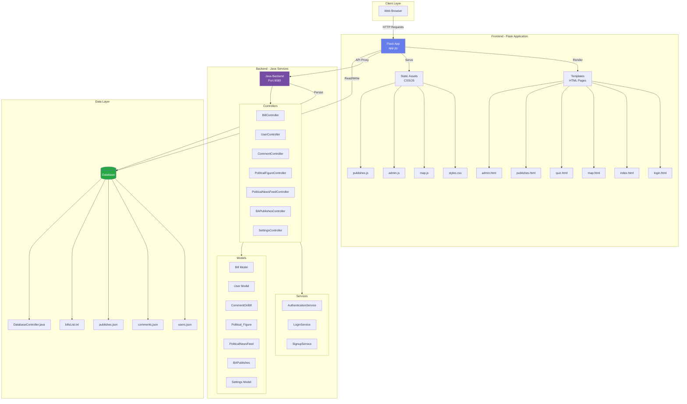
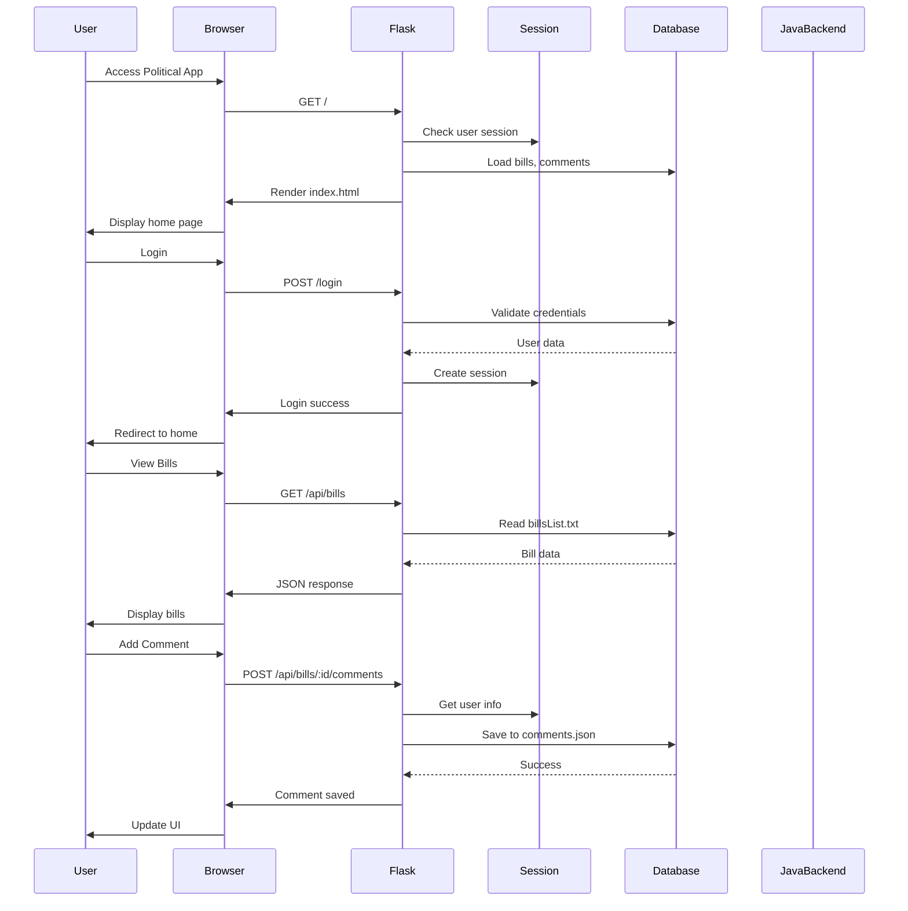
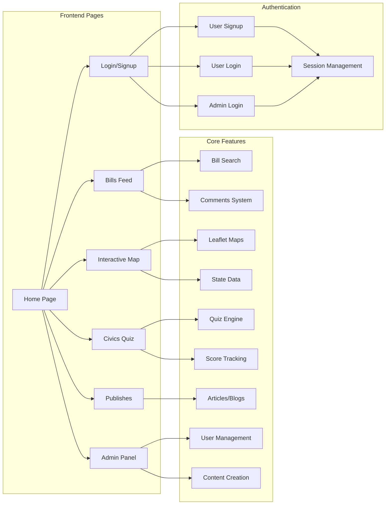
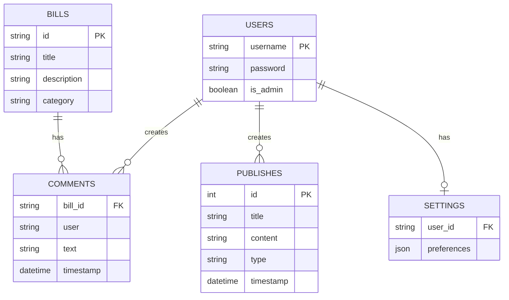
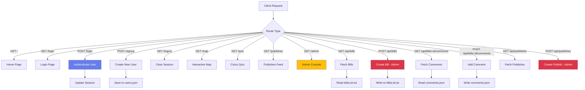
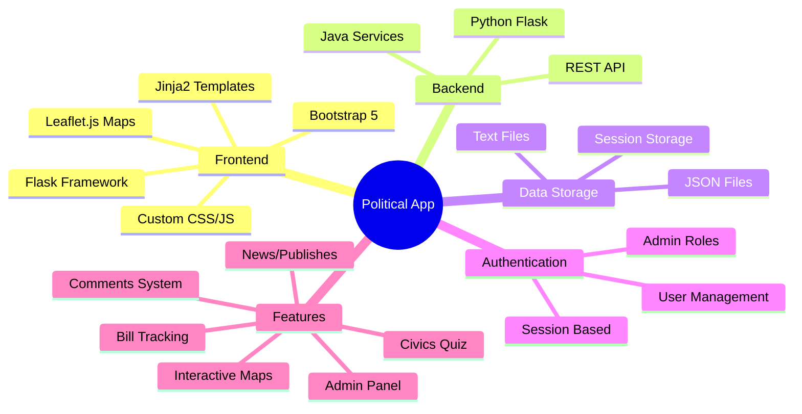
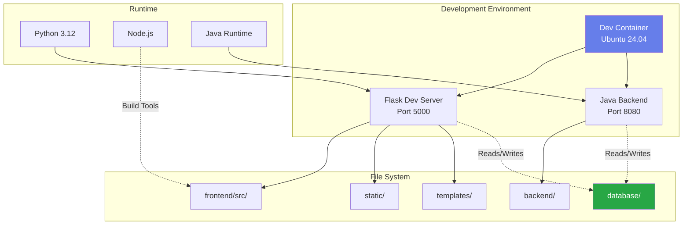
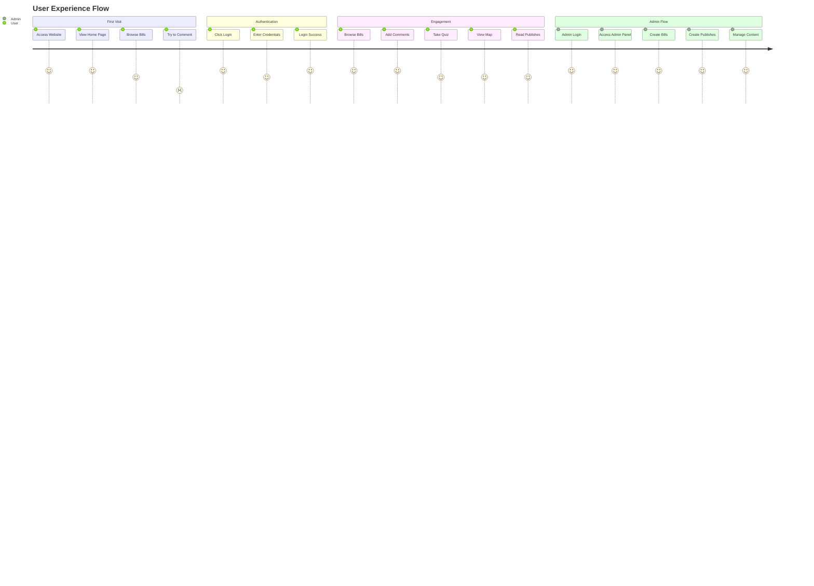
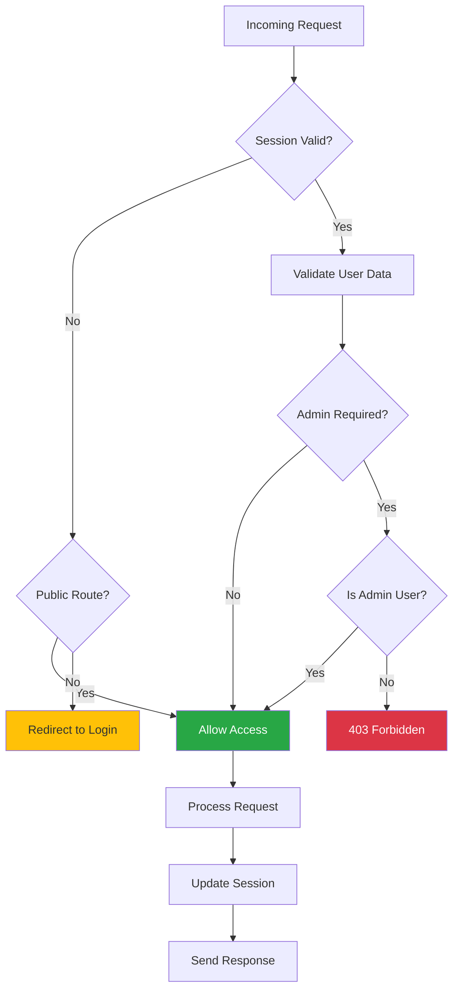

# Political App - Architecture Documentation

## System Overview

This document provides a visual representation of the Political App architecture using Mermaid diagrams.

## Architecture Diagram



## Data Flow Diagram



## Component Architecture



## Database Schema



## API Routes Flow



## Technology Stack



## Deployment Architecture



## User Journey Map



## Security Flow



---

## File Structure

```
Political_App/
├── frontend/
│   └── src/
│       ├── app.py                 # Main Flask application
│       ├── static/
│       │   ├── css/
│       │   │   └── styles.css     # Global styles
│       │   └── js/
│       │       ├── map.js         # Interactive map logic
│       │       ├── admin.js       # Admin panel logic
│       │       └── publishes.js   # Publishes page logic
│       └── templates/
│           ├── base.html          # Base template
│           ├── index.html         # Home page
│           ├── login.html         # Login/Signup page
│           ├── map.html           # Interactive map
│           ├── quiz.html          # Civics quiz
│           ├── publishes.html     # Articles/Blogs
│           ├── admin.html         # Admin console
│           └── settings.html      # User settings
├── backend/
│   ├── controller/                # Java controllers
│   ├── login/                     # Authentication services
│   └── models/                    # Data models
├── database/
│   ├── users.json                 # User accounts
│   ├── comments.json              # Bill comments
│   ├── publishes.json             # Articles/Blogs
│   └── billsList.txt              # Bill data
└── docs/
    └── SRS.md                     # Requirements doc
```

## Key Features Summary

1. **User Authentication**
   - Signup/Login with session management
   - Admin role-based access control
   - Persistent sessions (7 days)

2. **Bill Management**
   - Browse and search bills
   - Comment system with user attribution
   - Category filtering

3. **Interactive Map**
   - Leaflet.js integration
   - State capitals, major cities, congressional districts
   - Multiple map styles (street, satellite, terrain)

4. **Civics Quiz**
   - 10 questions with instant feedback
   - Detailed explanations
   - Score tracking and badges

5. **Publishes System**
   - Articles and blogs
   - Search and filter functionality
   - Admin content creation

6. **Admin Panel**
   - Create bills and publishes
   - Manage content
   - View all published items
