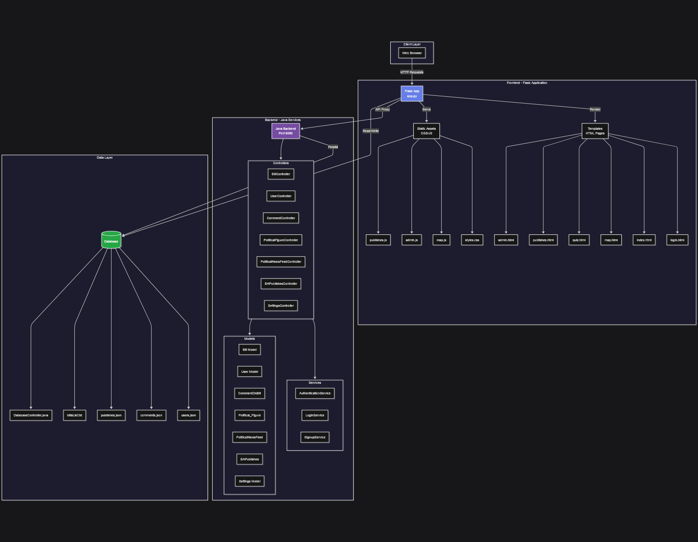

# 🏛️ Civic Engagement Platform

> **🚀 Quick Start:** To run the application, see **[RUN_INSTRUCTIONS.md](RUN_INSTRUCTIONS.md)** for complete setup guide!
>
> **TL;DR:** `pip install flask flask-cors requests` → `python3 frontend/src/app.py` → Open `http://localhost:5000`

## 📘 Project Overview
This project is a civic engagement platform designed to help users interact with political content, track bills, follow political figures, and comment on legislation. It integrates a mix of MVC patterns across a Flask frontend and Java backend services.

**Current Features:**
- ✅ User authentication (signup/login) with JSON persistence
- ✅ View and search legislative bills
- ✅ Comment on bills (comments saved to database)
- ✅ Admin console for managing content
- ✅ Published articles and blog posts
- ✅ All data persists to JSON files

---

## 🧱 Software Architecture

### 📊 Architectural Diagram

### UML Class Diagram

The UML class diagram for the repository is included below. It models the main domain entities, controllers, services, and persistence layer.

---

Presentation Layer (MVC Controllers)

This is the topmost layer and consists of the controllers and user interface code.

Components:

AppManager

UserController

BillController

PoliticalFigureController

Responsibilities:

Receives user actions (menu selections, input commands)

Translates UI requests into service-layer calls

Formats data before displaying back to the user

Does not implement business logic

Communication:

Controllers → call → Service Layer Managers
Controllers → display output → User

This is equivalent to the Presentation Layer described in the sample file where Spring Controllers handle requests and rely on Services to execute logic

...